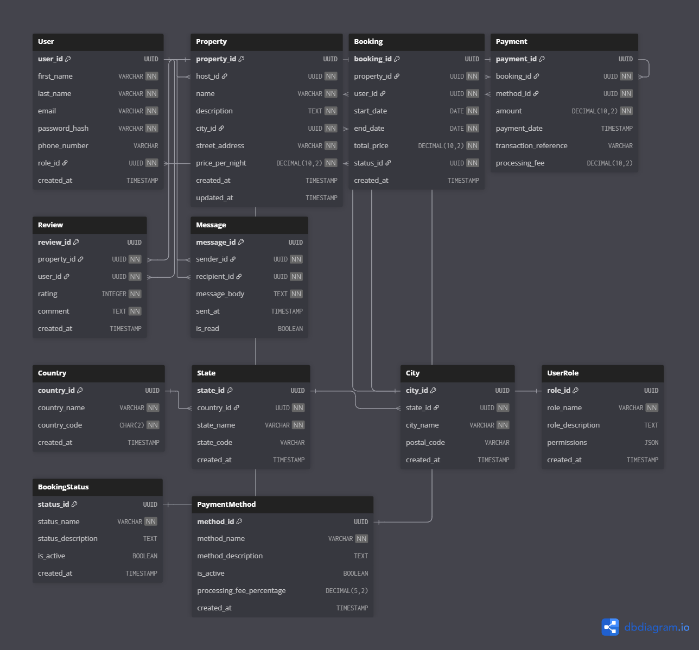

# AirBnB Database Normalization to Third Normal Form (3NF)

## Executive Summary

After analyzing the original AirBnB database schema, I identified several normalization opportunities to achieve Third Normal Form (3NF). The main improvements include separating location data, creating lookup tables for enum values, and ensuring all non-key attributes are fully functionally dependent on primary keys.

## Original Schema Analysis

### Normalization Forms Review

**First Normal Form (1NF):**  Already Achieved
- All attributes contain atomic values
- No repeating groups
- Each row is unique (ensured by primary keys)

**Second Normal Form (2NF):**  Already Achieved
- All tables are in 1NF
- No partial dependencies (all non-key attributes fully depend on the entire primary key)
- All tables use single-column primary keys (UUIDs)

**Third Normal Form (3NF):** Violations Identified

## Identified 3NF Violations and Issues

### 1. **Location Data in Property Table**
**Issue:** The `location` field is stored as a single VARCHAR, which could contain redundant city, state, and country information.

**Problem:** If multiple properties are in the same city, we're storing duplicate location strings, leading to:
- Data redundancy
- Potential inconsistency in location naming
- Difficulty in location-based queries

### 2. **ENUM Values Hardcoded**
**Issue:** Role, booking status, and payment method are stored as ENUMs.

**Problem:** While not strictly a 3NF violation, this approach:
- Makes it difficult to add new values without schema changes
- Lacks referential integrity
- Cannot store additional metadata about these values

### 3. **Potential Transitive Dependencies**
**Issue:** Some derived information could be calculated rather than stored.

## Normalized Schema (3NF Compliant)

### New Tables Added

#### **Country Table**
```sql
Table Country {
  country_id UUID [pk]
  country_name VARCHAR [not null, unique]
  country_code CHAR(2) [not null, unique]
  created_at TIMESTAMP [default: `CURRENT_TIMESTAMP`]
}
```

#### **State/Province Table**
```sql
Table State {
  state_id UUID [pk]
  country_id UUID [ref: > Country.country_id, not null]
  state_name VARCHAR [not null]
  state_code VARCHAR [null]
  created_at TIMESTAMP [default: `CURRENT_TIMESTAMP`]
}
```

#### **City Table**
```sql
Table City {
  city_id UUID [pk]
  state_id UUID [ref: > State.state_id, not null]
  city_name VARCHAR [not null]
  postal_code VARCHAR [null]
  created_at TIMESTAMP [default: `CURRENT_TIMESTAMP`]
}
```

#### **User Role Table**
```sql
Table UserRole {
  role_id UUID [pk]
  role_name VARCHAR [not null, unique]
  role_description TEXT [null]
  permissions JSON [null]
  created_at TIMESTAMP [default: `CURRENT_TIMESTAMP`]
}
```

#### **Booking Status Table**
```sql
Table BookingStatus {
  status_id UUID [pk]
  status_name VARCHAR [not null, unique]
  status_description TEXT [null]
  is_active BOOLEAN [default: true]
  created_at TIMESTAMP [default: `CURRENT_TIMESTAMP`]
}
```

#### **Payment Method Table**
```sql
Table PaymentMethod {
  method_id UUID [pk]
  method_name VARCHAR [not null, unique]
  method_description TEXT [null]
  is_active BOOLEAN [default: true]
  processing_fee_percentage DECIMAL [null]
  created_at TIMESTAMP [default: `CURRENT_TIMESTAMP`]
}
```

### Updated Tables

#### **Updated User Table**
```sql
Table User {
  user_id UUID [pk]
  first_name VARCHAR [not null]
  last_name VARCHAR [not null]
  email VARCHAR [unique, not null]
  password_hash VARCHAR [not null]
  phone_number VARCHAR [null]
  role_id UUID [ref: > UserRole.role_id, not null]
  created_at TIMESTAMP [default: `CURRENT_TIMESTAMP`]
}
```

#### **Updated Property Table**
```sql
Table Property {
  property_id UUID [pk]
  host_id UUID [ref: > User.user_id, not null]
  name VARCHAR [not null]
  description TEXT [not null]
  city_id UUID [ref: > City.city_id, not null]
  street_address VARCHAR [not null]
  price_per_night DECIMAL [not null]
  created_at TIMESTAMP [default: `CURRENT_TIMESTAMP`]
  updated_at TIMESTAMP [note: 'ON UPDATE CURRENT_TIMESTAMP']
}
```

#### **Updated Booking Table**
```sql
Table Booking {
  booking_id UUID [pk]
  property_id UUID [ref: > Property.property_id, not null]
  user_id UUID [ref: > User.user_id, not null]
  start_date DATE [not null]
  end_date DATE [not null]
  total_price DECIMAL [not null]
  status_id UUID [ref: > BookingStatus.status_id, not null]
  created_at TIMESTAMP [default: `CURRENT_TIMESTAMP`]
}
```

#### **Updated Payment Table**
```sql
Table Payment {
  payment_id UUID [pk]
  booking_id UUID [ref: > Booking.booking_id, not null]
  method_id UUID [ref: > PaymentMethod.method_id, not null]
  amount DECIMAL [not null]
  payment_date TIMESTAMP [default: `CURRENT_TIMESTAMP`]
  transaction_reference VARCHAR [null]
}
```

## Normalization Steps Performed

### Step 1: Decompose Location Data
**Action:** Replaced single `location` field with normalized location hierarchy.

**Benefits:**
- Eliminates redundant storage of city/state/country names
- Enables efficient location-based queries
- Maintains referential integrity for geographical data
- Supports international properties with proper country/state structure

### Step 2: Convert ENUMs to Reference Tables
**Action:** Created separate tables for user roles, booking statuses, and payment methods.

**Benefits:**
- Dynamic addition of new values without schema changes
- Ability to store additional metadata (descriptions, permissions, fees)
- Better referential integrity
- Historical tracking of changes to these values

### Step 3: Eliminate Transitive Dependencies
**Action:** Ensured all non-key attributes depend only on the primary key.

**Verification:**
-  User attributes depend only on user_id
-  Property attributes depend only on property_id
-  Booking attributes depend only on booking_id
-  Payment attributes depend only on payment_id
-  Review attributes depend only on review_id
-  Message attributes depend only on message_id

### Step 4: Maintain Data Integrity
**Action:** Preserved all original foreign key relationships while adding new ones.

**Enhancements:**
- Added constraints for data validation
- Maintained audit trails with timestamps
- Added soft delete capabilities where appropriate

## 3NF Compliance Verification

### First Normal Form (1NF) 
- All attributes are atomic
- No repeating groups
- Each table has a primary key
- All rows are unique

### Second Normal Form (2NF) 
- Meets 1NF requirements
- All non-key attributes are fully functionally dependent on the primary key
- No partial dependencies (all PKs are single columns)

### Third Normal Form (3NF) 
- Meets 2NF requirements
- No transitive dependencies
- All non-key attributes depend directly on the primary key
- Location hierarchy eliminates redundancy
- Reference tables eliminate enum redundancy

## Benefits of the Normalized Design

### 1. **Reduced Data Redundancy**
- Location names stored once per city/state/country
- Role/status/method names stored in dedicated tables
- Elimination of duplicate string values

### 2. **Improved Data Integrity**
- Referential integrity through foreign keys
- Consistent location naming
- Centralized management of lookup values

### 3. **Enhanced Flexibility**
- Easy addition of new roles, statuses, or payment methods
- Support for international locations
- Ability to add metadata to lookup tables

### 4. **Better Query Performance**
- Indexed location hierarchy for efficient geographical queries
- Smaller table sizes due to reduced redundancy
- Optimized joins through proper indexing

### 5. **Maintainability**
- Changes to lookup values in one place
- Clear separation of concerns
- Easier to extend schema for new requirements

## New ERD


## Link to interactive ERD
https://dbdiagram.io/d/ERD_normalised-68b41fa4777b52b76c585fd6
## Conclusion

The normalized 3NF design eliminates redundancy while maintaining all functional requirements of the original schema. The separation of location data and conversion of enums to reference tables provides a more flexible, maintainable, and scalable database structure that will better support the growth and evolution of the AirBnB platform.